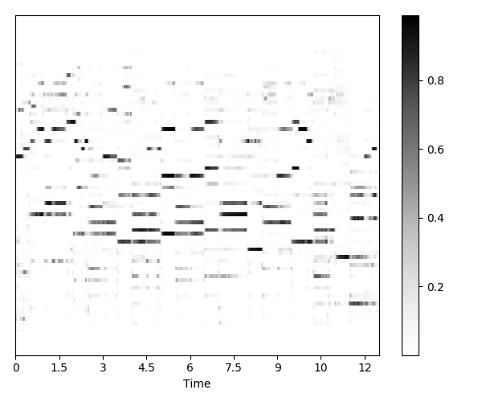

# Automatic Music Transcription using WaveNet

This is my implementation of [WaveNet for Transcription](https://vgg.fiit.stuba.sk/people/martak/amt-wavenet) that accompanies this [published work](https://ieeexplore.ieee.org/abstract/document/8439708) (see [\[PDF\]](https://vgg.fiit.stuba.sk/wp-uploads/2018/09/iwssip2018_wavenet.pdf) of the preprint).

The code is based off of [Igor Babuschkin](https://github.com/ibab)'s excellent [implementation](https://github.com/ibab/tensorflow-wavenet) of [WaveNet](https://deepmind.com/blog/wavenet-generative-model-raw-audioA/) neural network architecture.

## Outline

In this project, WaveNet is no longer autoregressive generative model, but rather multi-class multi-label classifier model that performs frame-level transcription of polyphonic music.

Each data sample (as produced by the [reader](readers)) is processed by WaveNet's stack of dilated causal convolutions. All convolutional layers in the stack use stride of 1. This produces outputs with temporal resolution equal to the input's sampling frequency (default is 16 kHz). On top of this stack we have two post-processing layers finished with sigmoid activation that allows for multi-label predictions.

Each prediction of the model solves the multiple fundamental frequency (F0) estimation problem for the given input time frame. As inputs for individual predictions are extracted by sliding window over the input snippet (a property of WaveNet processing mechanics), model inference results in process of frame-level transcription.

<p align="center">
  <br>
  <i>WaveNet for Transcription. Image courtesy of <a href="https://arxiv.org/abs/1609.03499">WaveNet</a> authors.</i>
</p>

In the diagram above, gray numbers denote hyperparameter setting (number of channels used across the network) that was determined with constraint of 12GB GPU memory. We used NVIDIA Titan X with Maxwell architecture for this project.

_Note, that audio waveform and piano roll as depicted in the diagram are only illustrative (they will correspond to each other if the midi is correctly aligned with audio in the training dataset)._

## Requirements

[TensorFlow](https://www.tensorflow.org/) needs to be installed in order to use this implementation.
Code was tested on TensorFlow versions 1.6.0 and 1.11.0 for Python 3.6.

In addition, [librosa](https://github.com/librosa/librosa) must be installed for manipulating audio, [pretty_midi](https://github.com/craffel/pretty-midi) for manipulating midi, and [mir_eval](https://github.com/craffel/mir_eval) along with [matplotlib](https://matplotlib.org) for visualizing inference/evaluation results.

To install the required python packages, run
```bash
pip3 install -r requirements.txt
```

For GPU support, use
```bash
pip3 install -r requirements_gpu.txt
```

## Training the network

In order to test your installation, execute
```bash
mkdir -p logs/sanitycheck
python3 train.py --logdir=logs/sanitycheck
```
to train the network to recognize the middle-C on simple [sanity check](data/sanitycheck) dataset.

As a result, you should see convergence within first ~1000 training steps and `train.py` should terminate automatically, while explaining itself.
> `Trainer stops training since metric crossed stop boundary 0.999 with value 0.9991437050591782`


You can see documentation on each of the training settings by running
```bash
python3 train.py --help
```

You can use any dataset consisting of pairs of `.wav` and `.mid` files. Dataset can be augmented with multiple audio files synthesized from midi labels using different instrument sound fonts. In such case, if there are multiple `.wav` files corresponding to a single `.mid` file, they should have corresponding prefix, e.g. label `$(fname).mid` would be used with inputs `$(fname)_piano_A.wav`, `$(fname)_piano_B.wav` and so on. Dataset can be organized into sub-folders, as long as corresponding files are together in the same folder.

You can find the configuration of the model parameters in [`model_params.json`](model_params.json).
These need to stay the same between training and generation.

Training hyperparameters can be found in [`training_params.json`](training_params.json).
These can be adjusted between different training sessions.

Other parameters of training, such as intermediate evaluation, model checkpointing, and metadata storage for later debugging in tensorboard are stored in [`runtime_switches.json`](runtime_switches.json).
These can be modified even during the execution of [`train.py`](train.py), which reloads the file regularly to check for latest settings.

## Testing the network

The network is already used for inference on validation data regularly during training - to generate intermediate performance evaluations for TensorBoard monitoring.

When the model is trained, you can use [`test.py`](test.py) to do following:
* evaluate its performance on test data
* store performance metrics
* store raw transcription of the test set in [`.npy`](https://docs.scipy.org/doc/numpy-1.14.0/neps/npy-format.html) format
* generate multi-media files from the transcription, such as
	* draw figures of estimated and evaluated piano rolls
	* synthesize audio of generated transcriptions

If you executed sanity-check training before, you can now use the model for inference
```bash
python3 test.py --media=True --logdir=logs/sanitycheck/best
```
where `logdir` is expected to contain model checkpoint files and `media` switch enables to generate visual and audible evaluation outputs into TensorBoard (see IMAGES and AUDIO boards) as well as separate media files to be stored in `logdir`.

Usage of the testing script is also documented by
```bash
python3 test.py --help
```

### Generating transcriptions

Currently one needs to use [`test.py`](test.py) to generate transcriptions, which also requires data files with MIDI labels.

#### Examples

To get an idea of the performance of trained (not fine-tuned) transcription model in terms of quality of generated transcriptions, here are some results on two audio samples.

First sample – an excerpt from a piece by J. S. Bach – is from training distribution. The other one – an excerpt form a piece be Hiromi Uehara – is purposefully chosen from out of training distribution.

Table below shows the transcription results for selected samples. The shade of gray in prediction figures denotes probability of note presence, black for present, white for absent. In the estimation plot, green denotes correct note detections, red shows present but undetected notes, blue absent but falsely detected notes, and white the remaining major case: absent and correctly undetected notes.

| Sample        | Predicted                  | Evaluated                 |
|---------------|----------------------------|---------------------------|
| J. S. Bach    |  |  |
| Hiromi Uehara |  |  |

For both samples, you can listen to the input and its transcription separately as well as overlaid in this [SoundCloud album](https://soundcloud.com/user-127638743/sets/amt-wavenet-demo-tracks).

## Missing features:
* A `transcribe.py` script to enable generating transcriptions using a previously trained model, including hamming window smoothing of predictions, possibly supplied soundfont for `fluidsynth` synthesis, and not requiring labels for performance evaluation as [`test.py`](test.py) does.
