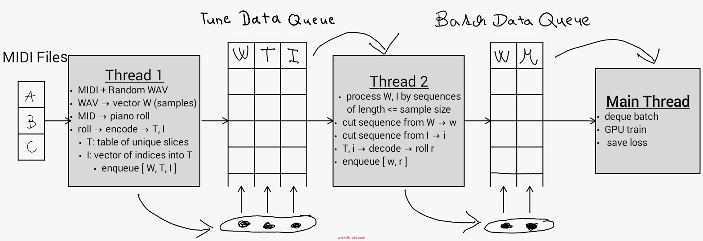

# Readers

Module for dataset readers.

## WAV-MID Reader

This reader produces batch data samples given path to corpus of audio-midi file pairs.

### General workflow

**Thread 1**: loading tunes (single worker suffices)
* processes (`wav`, `mid`) pairs of audio and midi files in randomized order
	* if single `mid` file has multiple corresponding `wav` files (e.g. multiple soundfonts used for synthesis of midi file for the sake of data augmentation), one is randomly chosen
* audio -> waveform, midi -> piano roll
* encodes piano roll memory-efficiently (see figure below) and stores it along with waveform in _Tune Data Queue_

**Thread 2**: preparing samples for training batches (multiple worker processes)
* pulls tune data out of _Tune Data Queue_
* cuts each tune into pieces `sample_size` large
* padds audio waveform from left and right to preserve output shape and center each input against the time frame of its label in corresponding piano roll
* stores prepared data sample in the _Batch Data Queue_

**Main Thread**
* loads batch by pulling multiple samples from _Batch Data Queue_
* iterates the training step

### _Notes_

* This reader is implemented using TensorFlow [Queues](https://www.tensorflow.org/api_docs/python/tf/train/Coordinator) with [Coordinator](https://www.tensorflow.org/api_docs/python/tf/train/Coordinator), which are now deprecated. New [**tf.data** API](https://www.tensorflow.org/api_docs/python/tf/data) should be used instead.

* Since [sample padding](https://www.tensorflow.org/api_docs/python/tf/PaddingFIFOQueue) with `dequeue_many` operation was not available in combination with [shuffling queues](https://www.tensorflow.org/api_docs/python/tf/RandomShuffleQueue), the only source of shuffling comes from parallel operation of multiple workers over the _Batch Data Queue_ which is quite weak and probably produces streams of strongly correlated data samples (always just a subset of few tunes in a line) considering each worker gets equal share of opportunities to push. See [this](http://www.moderndescartes.com/essays/shuffle_viz/) for illustration.
